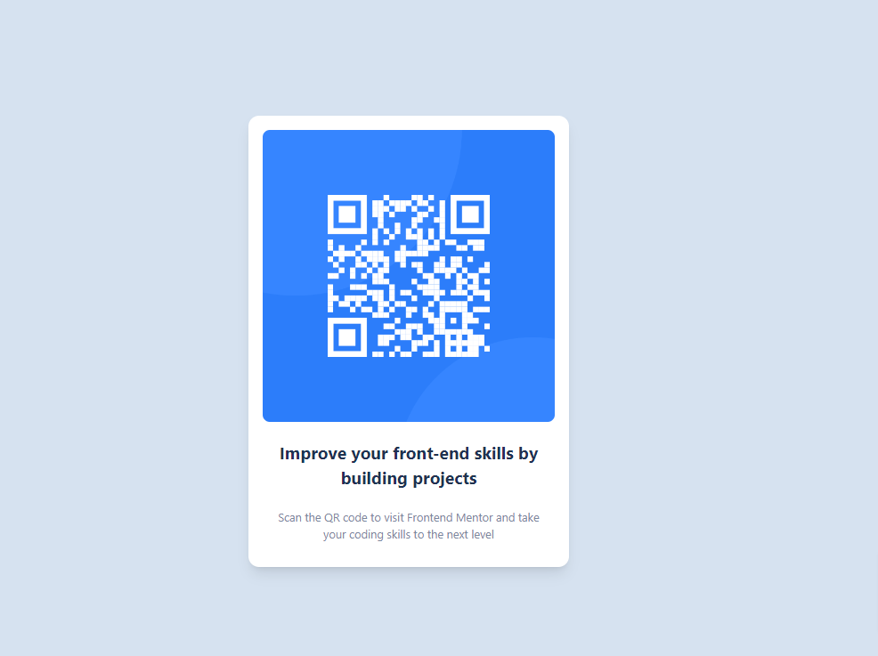

# Frontend Mentor - QR code component solution

This is a solution to the [QR code component challenge on Frontend Mentor](https://www.frontendmentor.io/challenges/qr-code-component-iux_sIO_H). Frontend Mentor challenges help you improve your coding skills by building realistic projects. 

## Table of contents

- [Overview](#overview)
  - [Screenshot](#screenshot)
  - [Links](#links)
- [My process](#my-process)
  - [Built with](#built-with)
  - [What I learned](#what-i-learned)
  - [Continued development](#continued-development)
  - [Useful resources](#useful-resources)
- [Author](#author)
- [Acknowledgments](#acknowledgments)

**Note: Delete this note and update the table of contents based on what sections you keep.**

## Overview

### Screenshot

### Links

- Solution URL: [https://www.frontendmentor.io/solutions/qr-code-component-_l7EWVk6DA]
- Live Site URL: [https://n3ndor.github.io/FrontendMentor/projects/qr-code-component/index.html]

## My process

### Built with

- Semantic HTML5 markup
- TailwindCSS
- Flexbox

**Note: These are just examples. Delete this note and replace the list above with your own choices**

### What I learned

I learned a way how to set the font size differently in TailwindCSS:

text-[1.2rem]

### Continued development

This was a basic example, hopefully I made it how it should be. But later I will review again.

## Author

- Website - [https://n3ndor.vercel.app/](https://www.your-site.com)
- Frontend Mentor - [https://www.frontendmentor.io/profile/n3ndor](https://www.frontendmentor.io/profile/yourusername)

## Acknowledgments

Thanks for Souhail I observed my first try was not perfect.

https://www.frontendmentor.io/profile/SouhailM07
